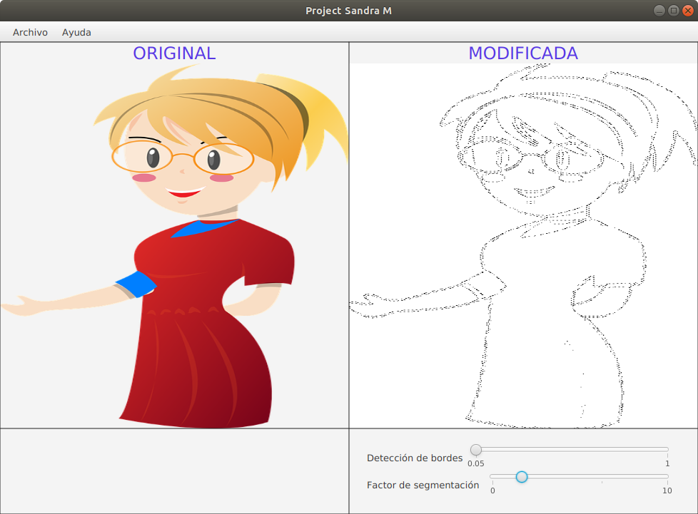

# ProjectSandra
Project Sandra es un software diseñado para profesionales de la eduación.
Su objetivo es procesar imágenes para adaptarlas a guías educativas.

El proceso consiste en quitar el color e identificar y segmentar los bordes de la imagen. Una vez cumplido el objetivo
el usuario puede guardar la imagen resultante en su disco duro.

  
